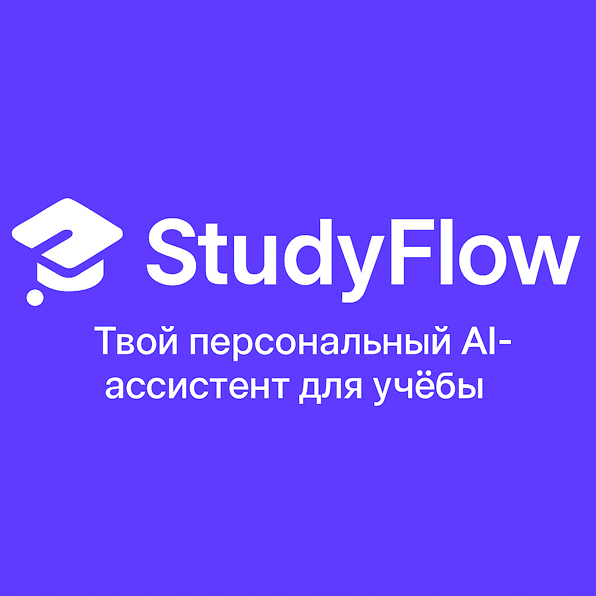

# 🎓 StudyFlow — твой персональный AI-ассистент для учёбы

**StudyFlow** — это современный AI-ассистент, помогающий студентам и школьникам:
- решать задачи и генерировать пояснения за секунды,
- готовиться к экзаменам с пошаговыми подсказками,
- писать конспекты, эссе и дипломы,
- управлять временем и стрессом.

Всё это — в одном интерфейсе: сайт + Telegram-мини-приложение.

---

## 🚀 Технологии
- **Next.js 14** + **React 18**
- **Tailwind CSS**
- **TypeScript**
- **Railway** (Frontend/Backend hosting)
- **PostgreSQL**
- **FastAPI / aiogram** (бот-интеграция)

---

## ⚙️ Локальный запуск
```bash
# Установить зависимости
npm install

# Запустить локально
npm run dev
